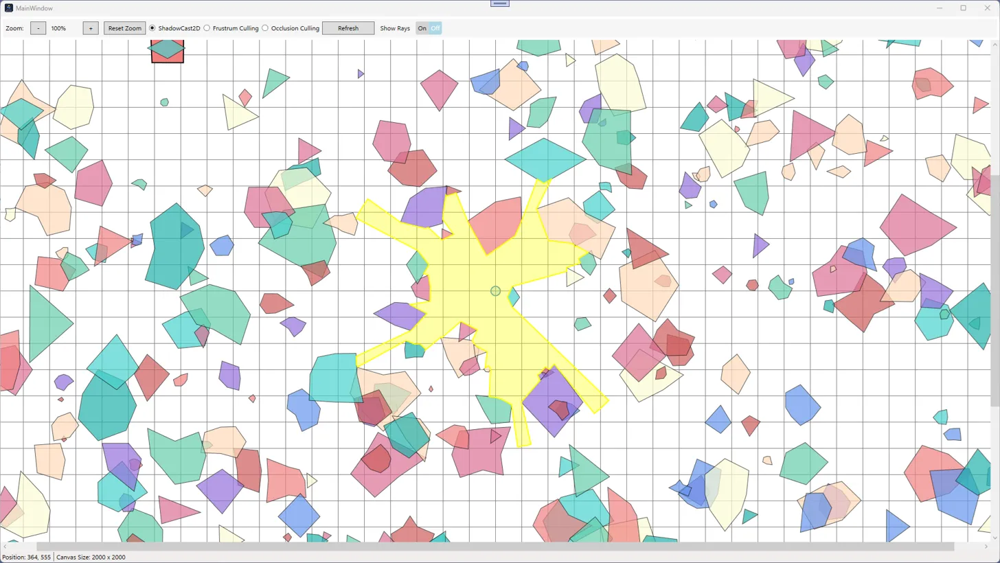
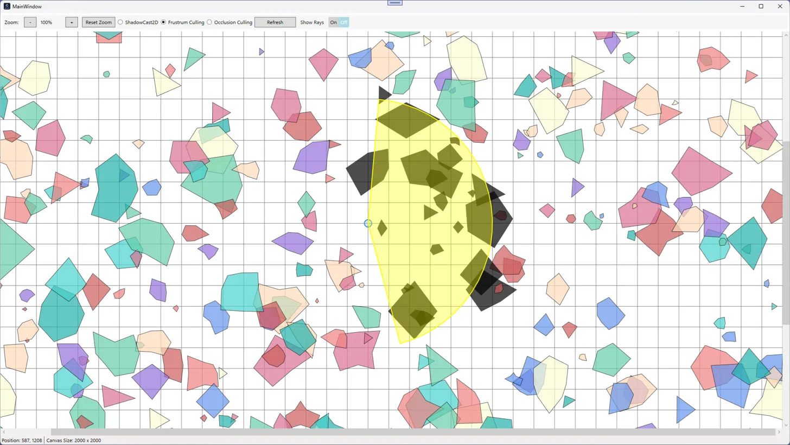
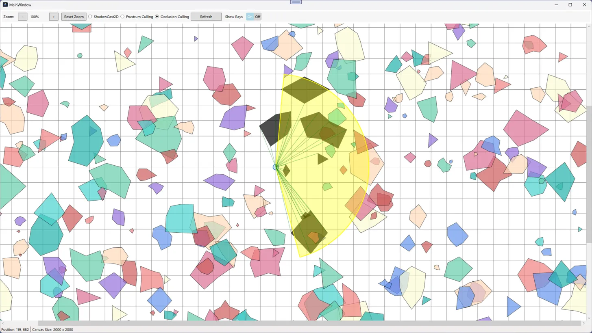

# VisibilityEngine2D

A sophisticated C# WPF application demonstrating various 2D visibility and culling techniques in a dynamic grid environment.

## Screenshots

### Shadow Casting

Shadow casting provides 360-degree visibility calculation using ray casting techniques. The yellow area represents the visible region from the viewpoint.

### Frustum Culling

Frustum culling demonstrates a cone of vision with a specified field of view (FOV) angle. Objects within this cone are rendered in their original colors, while others are filtered out.

### Occlusion Culling

Occlusion culling shows advanced visibility determination with ray visualization. Objects that are visible from the viewpoint are highlighted, while occluded objects behind obstacles maintain their original appearance.

## Features

- **Multiple Visibility Algorithms**
  - Shadow Casting: Calculates visibility using ray casting and shadow computation
  - Frustum Culling: Implements view frustum culling for efficient rendering
  - Occlusion Culling: Advanced visibility determination using occlusion techniques
  
- **Interactive Visualization**
  - Real-time visibility updates
  - Dynamic camera position control
  - Adjustable field of view (FOV) and view direction
  - Visualization rays toggle option
  
- **Performance Optimizations**
  - Spatial indexing for efficient collision detection
  - Parallel ray processing
  - Grid-based space partitioning

## Technical Details

### Grid System
- Canvas Size: 2000x2000 pixels
- Grid Size: 50 pixels
- Customizable grid line thickness
- Zoom range: 0.1x to 5.0x

### View Controls
- Double-click to set view position
- Ctrl + Mouse wheel for zooming
- Alt + Arrow keys to adjust FOV and direction
- Drag to pan the view

### Supported Features
- Random polygon generation
- Spatial indexing for collision detection
- Multiple visualization modes
- Performance timing utilities
- UI zoom controls

## Requirements

- .NET Core 6.0 or later
- Windows OS (WPF dependency)
- Visual Studio 2022 or compatible IDE

## Project Structure

```
VisibilityIn2DGrid/
├── Culling/
│   ├── FrustumCuller.cs
│   └── OcclusionCuller.cs
├── Extensions/
│   ├── MouseExtensions.cs
│   ├── PolygonExtensions.cs
│   └── WindowExtensions.cs
├── Geometry/
│   ├── Bounds.cs
│   └── Circle.cs
├── Helper/
│   ├── GridLineGenerator.cs
│   ├── RandomPolygonGenerator.cs
│   └── TimingHelper.cs
├── Index/
│   ├── GridCell.cs
│   └── SpatialIndex.cs
├── RayTracing/
│   └── ShadowCast2D.cs
└── UI/
    ├── Constants/
    │   └── ViewConstants.cs
    ├── Controllers/
    │   ├── VisualizationController.cs
    │   └── ZoomController.cs
    └── ViewState.cs
```

## Installation

1. Clone the repository:
```bash
git clone https://github.com/yourusername/VisibilityIn2DGrid.git
```

2. Open the solution in Visual Studio 2022

3. Build and run the application

## Usage

1. Launch the application
2. Use the radio buttons to switch between visualization modes:
   - Shadow Cast
   - Frustum Culling
   - Occlusion Culling
3. Double-click anywhere on the grid to set the view position
4. Use Alt + Arrow keys to adjust the view angle and FOV when in Frustum or Occlusion mode
5. Toggle the "Show Rays" checkbox to visualize ray casting
6. Use the "Refresh" button to generate a new set of random polygons

## Performance Considerations

- The spatial index helps maintain good performance with large numbers of polygons
- Parallel processing is used for ray casting calculations
- Grid-based space partitioning reduces collision detection overhead
- Efficient polygon intersection algorithms minimize computation time

## Contributing

1. Fork the repository
2. Create a feature branch
3. Commit your changes
4. Push to the branch
5. Create a Pull Request

## License

MIT License

Copyright (c) 2024

Permission is hereby granted, free of charge, to any person obtaining a copy
of this software and associated documentation files (the "Software"), to deal
in the Software without restriction, including without limitation the rights
to use, copy, modify, merge, publish, distribute, sublicense, and/or sell
copies of the Software, and to permit persons to whom the Software is
furnished to do so, subject to the following conditions:

The above copyright notice and this permission notice shall be included in all
copies or substantial portions of the Software.

THE SOFTWARE IS PROVIDED "AS IS", WITHOUT WARRANTY OF ANY KIND, EXPRESS OR
IMPLIED, INCLUDING BUT NOT LIMITED TO THE WARRANTIES OF MERCHANTABILITY,
FITNESS FOR A PARTICULAR PURPOSE AND NONINFRINGEMENT. IN NO EVENT SHALL THE
AUTHORS OR COPYRIGHT HOLDERS BE LIABLE FOR ANY CLAIM, DAMAGES OR OTHER
LIABILITY, WHETHER IN AN ACTION OF CONTRACT, TORT OR OTHERWISE, ARISING FROM,
OUT OF OR IN CONNECTION WITH THE SOFTWARE OR THE USE OR OTHER DEALINGS IN THE
SOFTWARE.

## Acknowledgments

- Thanks to all contributors who have helped with the development
- Inspired by various 2D visibility and culling techniques in game development

## Contact

- Email: shalahuddinshanto@gmail.com
- LinkedIn: [Md. Shalah Uddin](https://www.linkedin.com/in/md-shalah-uddin)