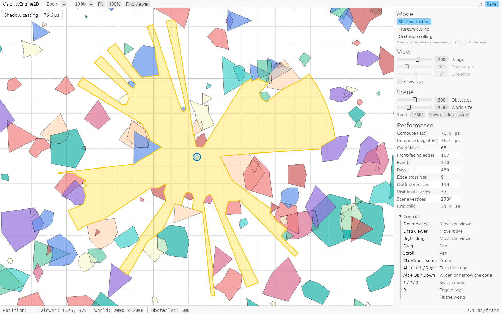
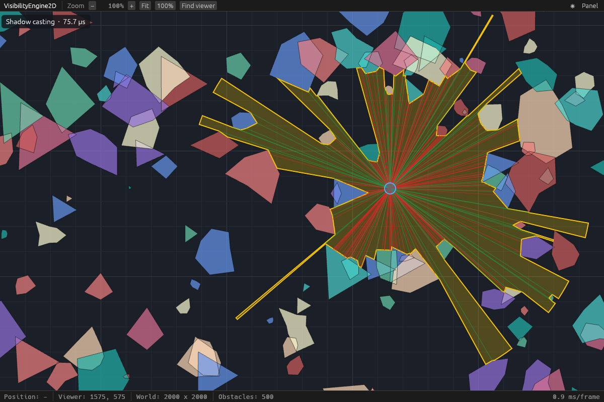
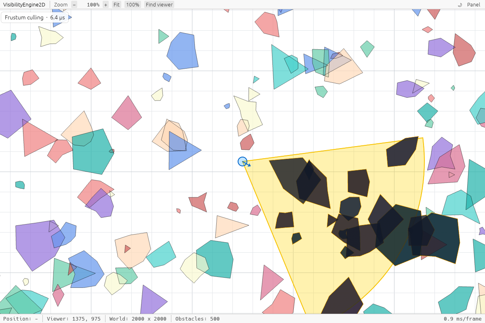
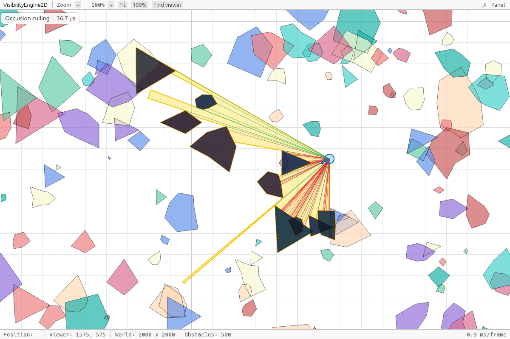
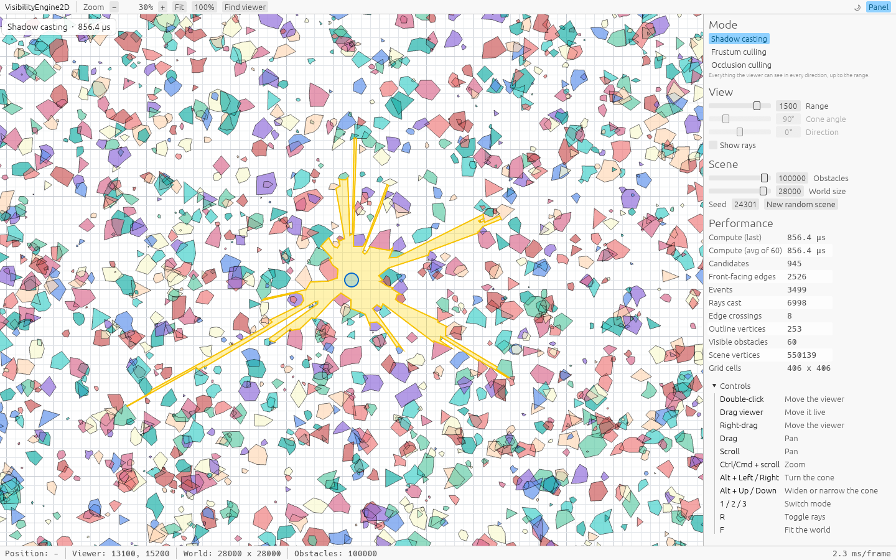

# VisibilityEngine2D

[](https://github.com/shanto462/VisibilityEngine2D/actions/workflows/ci.yml)
[](https://github.com/shanto462/VisibilityEngine2D/actions/workflows/codeql.yml)
[](https://scorecard.dev/viewer/?uri=github.com/shanto462/VisibilityEngine2D)
[](LICENSE)
[](Cargo.toml)

Fast, exact 2D visibility for worlds full of polygon obstacles: **shadow casting**
(what can I see?), **frustum culling** (what is inside my view cone?) and
**occlusion culling** (what is really visible, not hidden behind something else?).

It is a Rust library and an interactive, GPU-rendered desktop app for Windows and
macOS.



- **Exact results.** The visible region follows obstacle edges exactly, corners are
  exact vertices, and thin obstacles are never skipped. Nothing is sampled.
- **Fast.** About 23 µs for a 360° visibility query in the default scene, and
  under 2 µs for frustum culling, on one CPU core.
- **Exact occlusion culling.** An obstacle counts as visible when any part of it
  can be seen, not only one of its corners.
- **Scales to big worlds.** 100,000 obstacles (550,000 vertices) pan and zoom
  smoothly, because the obstacles are uploaded to the GPU once.
- **Safe and portable.** The library forbids `unsafe` code, and the app has a single
  audited Windows console call. Windows and macOS, and Linux builds too.

## Gallery

| Shadow casting with rays (dark theme) | Frustum culling |
| --- | --- |
|  |  |
| **Green** rays reach an obstacle corner, **red** rays are blocked first. | Every obstacle that touches the cone is highlighted, hidden or not. |

| Occlusion culling | 100,000 obstacles |
| --- | --- |
|  |  |
| Only obstacles that are really visible inside the cone are highlighted. | A 28,000 × 28,000 world. The side panel shows live algorithm counters. |

## Performance

Mean time per query from random viewpoints, on one core of an Apple M4 Pro.
Reproduce it with `cargo run --release -p visibility-core --example bench`.

| Scene | Build scene + index | Shadow cast (360°) | Frustum culling (90°) | Occlusion culling (90°) |
| --- | ---: | ---: | ---: | ---: |
| 500 obstacles, 2000², range 300 | 64 µs | 23 µs | 1.2 µs | 9 µs |
| 3,000 obstacles, 2000², range 300 | 342 µs | 124 µs | 5.1 µs | 44 µs |
| 50,000 obstacles, 20000², range 1500 | 4.1 ms | 550 µs | 16 µs | 160 µs |

The first row is the scene the app opens with.

## Install

### Download

Download the archive for your system from the
[latest release](https://github.com/shanto462/VisibilityEngine2D/releases/latest):

| System | Archive | Run |
| --- | --- | --- |
| Windows (x64 or ARM64) | `visibility-engine-2d-<version>-<target>.zip` | `visibility-engine-2d.exe` |
| macOS (Apple Silicon or Intel) | `visibility-engine-2d-<version>-<target>.zip` | `VisibilityEngine2D.app` |
| Linux (x64) | `visibility-engine-2d-<version>-x86_64-unknown-linux-gnu.tar.gz` | `visibility-engine-2d` |

The macOS app is not notarized. The first time, right-click the app and choose
**Open**, or remove the download quarantine flag:

```bash
xattr -dr com.apple.quarantine VisibilityEngine2D.app
```

Every release has a `SHA256SUMS` file and a signed
[build provenance attestation](https://docs.github.com/en/actions/security-for-github-actions/using-artifact-attestations).
To check an archive:

```bash
gh attestation verify visibility-engine-2d-1.0.0-aarch64-apple-darwin.zip --repo shanto462/VisibilityEngine2D
```

### Build from source

Install Rust 1.95 or newer with [rustup](https://rustup.rs/), then:

```bash
git clone https://github.com/shanto462/VisibilityEngine2D.git
cd VisibilityEngine2D
cargo run --release
```

## Using the app

Pick a mode in the side panel, then move the viewer around. The yellow area is what
the viewer sees, and highlighted obstacles are the result of the culling test.

| Mode | Shows |
| --- | --- |
| **Shadow casting** | Everything the viewer can see in every direction, up to the range. |
| **Frustum culling** | Obstacles that touch the view cone, including hidden ones. |
| **Occlusion culling** | Obstacles in the view cone that are really visible. |

| Action | Control |
| --- | --- |
| Move the viewer | Double-click, drag the viewer, or right-drag anywhere |
| Pan | Drag, or scroll |
| Zoom | Ctrl + scroll (Cmd + scroll on macOS), pinch, or the toolbar buttons |
| Turn the cone | Alt + Left / Right (Option on macOS), or the Direction slider |
| Widen or narrow the cone | Alt + Up / Down, or the Cone angle slider |
| Switch mode | 1, 2, 3 |
| Show rays to obstacle corners | R |
| Show the whole world | F |

The side panel also sets the range, the number of obstacles (up to 200,000), the
world size and the random seed, and shows timings and algorithm counters. With
**Keep density** on (the default), the world grows with the obstacle count, so
200,000 obstacles get a 40,000 × 40,000 world instead of piling up.

### Command line

Every setting can also be given on the command line, which is handy for demos:

```bash
visibility-engine-2d --mode occlusion --rays --viewer 1575,575 --fov 120 --direction 150 --range 450
visibility-engine-2d --obstacles 100000 --world 28000 --range 1500 --zoom 0.3
```

| Option | Default | Meaning |
| --- | --- | --- |
| `--mode shadow\|frustum\|occlusion` | `shadow` | What to compute. |
| `--viewer X,Y` | free spot near the center | Viewer position in world units. |
| `--range R` | `300` | How far the viewer can see. |
| `--fov DEG` | `90` | Cone angle for frustum and occlusion culling. |
| `--direction DEG` | `0` | Cone direction. 0 points right, 90 points down. |
| `--rays` | off | Show rays toward obstacle corners. |
| `--obstacles N` | `500` | Number of random obstacles, up to 200,000. |
| `--world SIZE` | grows with `--obstacles` | World width and height. By default the world keeps the density of 500 obstacles per 2000 × 2000. |
| `--seed N` | `24301` | Random seed. The same seed gives the same world on every system. |
| `--zoom Z`, `--center X,Y` | 100% on the viewer (whole world if larger than 4000) | Initial camera. |
| `--window WxH` | `1440x900` | Window size. |
| `--theme light\|dark` | system | Color theme. |
| `--hide-panel` | off | Start without the side panel. |
| `--screenshot FILE.png` | none | Save a screenshot and exit. |

## How it works

**Scene.** All obstacle vertices live in one flat array. A uniform grid stores, for
every cell, the ids of the obstacles that overlap it, in one contiguous array. A
lookup is integer math and a slice walk, with no hashing.

**Shadow casting** builds the exact visible region inside the range:

1. Collect the obstacle edges that face the viewer and clip them to the range
   circle. Edges that face away can never be seen first, so about half of all edges
   are skipped.
2. Every clipped edge endpoint is an *event*: apart from places where two edges
   cross, these are the only angles where the nearest edge can change.
3. Put the edges in a small angular index, nearest first, so a ray only tests the
   edges at its own angle and stops at the first edge that is farther than its hit.
4. Cast one ray just before and one just after each event. Between two neighboring
   rays the outline is a straight piece of one edge, an arc of the range circle, or
   a switch between two crossing edges. The crossing point is computed exactly.

The work grows with the number of nearby edges, not with a fixed number of rays, and
the result has no sampling error.

**Occlusion culling** runs the same sweep inside the view cone. The obstacles that
own a piece of the visible outline are exactly the obstacles that can be seen.

**Frustum culling** tests each nearby obstacle against the cone with no
trigonometry: an obstacle overlaps the cone when one of its corners is inside, the
viewer is inside it, one of its edges crosses a straight side, or one of its edges
crosses the curved arc.

**Rendering.** The app draws obstacles with wgpu from vertex buffers that are filled
once per scene. Panning and zooming only change a small uniform, so the cost per
frame does not depend on the number of obstacles. The visible region, highlights and
rays are drawn on top with egui.

**Correctness.** The tests compare the visible outline with brute-force ray casting
on random and heavily overlapping scenes, check frustum culling against inner and
outer polygon approximations of the cone, and cover the cases that ray sampling
gets wrong: thin obstacles between rays, edges that cross only the arc, and a wall
that is visible between two posts while all its corners are hidden.

## Library

The algorithms are in the `visibility-core` crate, which has no GUI dependencies and
supports Rust 1.88 or newer.

```toml
[dependencies]
visibility-core = { git = "https://github.com/shanto462/VisibilityEngine2D" }
```

```rust
use visibility_core::{Scene, SceneConfig, Vec2, ViewCone, VisibilityOptions, compute_visibility, frustum_cull};

// 500 random obstacles in a 2000 x 2000 world.
let scene = Scene::random(&SceneConfig::default());
let viewer = Vec2::new(1375.0, 975.0);
let options = VisibilityOptions::default();

// Everything the viewer can see within 400 units, in every direction.
let vis = compute_visibility(&scene, &ViewCone::full(viewer, 400.0), &options);
println!("{} obstacles visible, outline has {} points", vis.visible.len(), vis.polygon.len());

// A 90 degree cone looking along +x: obstacles inside it, and the ones really seen.
let cone = ViewCone::sector(viewer, 400.0, 0.0, 90f64.to_radians());
let in_cone = frustum_cull(&scene, &cone).visible;
let seen = compute_visibility(&scene, &cone, &options).visible;
```

Use `Scene::new` with your own polygons in any winding order; polygon `i` of the
input has id `i` in every result. `Scene::cast_ray` answers single line-of-sight
questions. The `y` axis points down, as on screen, and angles are in radians, with 0
along `+x`.

## Project layout

```text
crates/
├── visibility-core/        Library: geometry, grid, visibility, frustum culling
│   ├── src/
│   ├── tests/              Brute-force comparison tests
│   └── examples/bench.rs   The benchmark above
└── visibility-app/         Desktop app (egui + wgpu)
    ├── src/
    └── assets/             App icons
assets/                     README images
scripts/readme-images.sh    Rebuilds the README images with the app's --screenshot mode
```

## Upgrading from the C# version

The first version of this project was a C# WPF app for Windows only. Version 1.0.0
is a complete rewrite in Rust that runs on Windows and macOS. It keeps the three modes,
the random obstacle generator and the controls, and fixes these problems of the
old version:

- Shadow casting cast 3,600 fixed rays. It cut corners between rays and could miss
  thin obstacles. It also added results to a shared list from parallel threads,
  which is a data race.
- Frustum culling missed obstacles whose edge crosses only the curved part of the
  cone.
- Occlusion culling tested only obstacle corners, so an obstacle whose corners were
  hidden but whose middle was visible was reported as hidden. Its blocking test also
  compared a ray parameter with a distance, so obstacles behind the target could
  hide it.
- The spatial index built a new string key for every grid lookup.
- Every obstacle was a WPF shape, so large worlds were slow to draw.

During the rewrite the new code was measured against a direct Rust port of the old
algorithms on the scenes above: shadow casting was 5 to 11 times faster (on one core,
against the old version on 12 cores), frustum culling 16 to 38 times faster, and
occlusion culling 1.4 to 4 times faster while now being exact.

## Contributing

Bug reports and pull requests are welcome. See [CONTRIBUTING.md](CONTRIBUTING.md)
for the development setup and the checks CI runs. Please report security issues
privately, as described in [SECURITY.md](SECURITY.md).

## License

[MIT](LICENSE)
